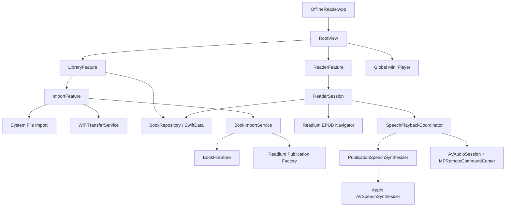

# 离线电子书阅读器 iOS MVP 产品与技术需求文档

> 工作名称：OfflineReader  
> 文档版本：1.0  
> 状态：可直接进入实现  
> 目标平台：iOS / iPadOS 18.0+  
> 目标读者：Codex、iOS 工程师、测试人员  
> 最后更新：2026-06-24

---

## 0. 给 Codex 的执行规则

本文件既是产品需求，也是实现合同。实现时遵守以下规则：

1. 严格按照本文的 MVP 范围实现，不主动增加 PDF、TXT、云同步、账号、书城、AI 问答、神经网络 TTS、OCR、DRM 或笔记功能。
2. 先保证每个里程碑能够编译和测试，再进入下一里程碑。不得一次性堆出大量无法运行的代码。
3. 所有核心路径必须是真实实现，不允许使用假数据、空方法、永久 `TODO`、仅打印日志的占位实现或“稍后接入”。
4. 固定依赖版本，不引用 `main`、`develop` 或不受控分支。
5. 以 Readium Swift Toolkit 3.9.0 的源码、文档和 TestApp 为 API 真相来源；不要凭记忆猜测 Readium API。
6. 使用 Swift 6 语言模式和严格并发检查。UI、Readium Navigator、SwiftData `ModelContext` 放在 `@MainActor`；文件、哈希、上传会话使用 actor 隔离。
7. 每完成一个里程碑，执行构建和测试；修复错误后再继续。最终提交不得存在编译警告、并发警告和测试失败。
8. 所有用户可见文本必须进入 String Catalog，至少提供简体中文和英文。
9. 不采集用户书籍内容，不接入分析 SDK，不向公网发送书籍、文本、朗读内容或使用数据。
10. 遇到本文未覆盖的细节，优先选择更小、更安全、更容易测试的实现，并在 `DECISIONS.md` 中记录决定，不扩大需求。

建议 Codex 的启动指令：

```text
请阅读仓库中的 docs/OfflineReader_iOS_MVP_PRD.md，把它视为实现合同。
先输出你准备采用的项目结构、依赖版本和里程碑 0 的文件清单，然后直接开始实现。
按文档中的 M0 至 M7 顺序工作；每个里程碑完成后运行构建和测试，修复全部错误再继续。
不要实现文档明确排除的功能，不要留下核心路径 TODO，不要用 mock 代替真实功能。
```

---

## 1. 产品摘要

OfflineReader 是一款只面向 Apple 移动平台的离线电子书阅读器。用户可以通过系统“文件”选择器或同一 Wi‑Fi 下的浏览器导入无 DRM 的 EPUB，在书架中管理书籍，以连续滚动方式阅读，并使用 Apple 设备端语音朗读正文。

MVP 的核心价值不是“支持很多格式”，而是完成一条稳定闭环：

```text
导入一本 EPUB
→ 在书架看到正确封面和元数据
→ 打开后获得舒适、可调整的排版
→ 从当前阅读位置开始朗读
→ 当前内容同步高亮并自动跟随
→ 锁屏或切到后台后仍能控制播放
→ 再次打开时恢复阅读和朗读位置
```

### 1.1 产品定位

- 本地优先：导入后无需账号和服务器。
- 阅读与听书一体：视觉阅读位置和朗读位置共享同一套 EPUB Locator。
- 小而稳定：首版只支持一种书籍格式和一种阅读布局。
- 可演进：朗读层预留 `TTSEngine` 扩展点，后续可以接入 Kokoro、Core ML 或 ONNX Runtime，但首版不包含模型。

### 1.2 MVP 成功标准

必须同时满足：

- 用户在飞行模式下能够打开已导入书籍并连续朗读。
- 用户可在电脑浏览器通过同一 Wi‑Fi 导入一本 EPUB。
- 退出阅读器、锁屏或切到其他 App 后，朗读不中断；锁屏可暂停和继续。
- 重新打开一本书时，恢复到上次阅读位置。
- 普通小说正文不会朗读脚注序号、导航文字或明显的 EPUB 噪声。
- 连续朗读 60 分钟无崩溃、无明显内存持续增长、无重复或跳句。

---

## 2. 范围

### 2.1 MVP 必须实现

| 模块 | 必须能力 |
|---|---|
| 平台 | iOS / iPadOS 18.0+；iPhone 优先，iPad 可正常使用 |
| 格式 | 无 DRM、可重排 EPUB 2/3 |
| 导入 | 系统文件导入；同一 Wi‑Fi 浏览器分块上传 |
| 书架 | 封面、书名、作者、进度、最近阅读、删除、排序 |
| 阅读 | 连续垂直滚动、目录跳转、位置恢复、点击隐藏/显示工具栏 |
| 排版 | 主题、字体类别、字号、行距、页边距、重置 |
| 朗读 | 播放/暂停、上一段/下一段、语速、语言、声音选择 |
| 同步 | 当前朗读片段高亮、朗读位置自动跟随、从可见位置开始 |
| 系统播放 | 后台音频、锁屏信息、耳机与系统远程控制、中断处理 |
| 离线 | 阅读与朗读不依赖公网或自有服务 |
| 数据 | 本地 SwiftData 元数据；文件存储于 Application Support |
| 国际化 | 简体中文、英文 |
| 测试 | 单元测试、集成测试、关键真机验收清单 |

### 2.2 明确不做

以下功能不得出现在 MVP：

- PDF、TXT、MOBI、AZW、CBZ、网页、扫描件、OCR。
- DRM、书城、OPDS、在线下载、版权内容分发。
- 登录、账号、订阅、购买、云同步、iCloud 跨设备同步。
- AI 问答、总结、翻译、知识库、向量检索、大语言模型。
- 自研或第三方神经 TTS 模型、声音克隆、多角色配音。
- 背景音乐、环境音、播放列表、睡眠定时器。
- 高亮笔记、书签、搜索、导出、社交分享。
- 分页模式、双栏模式、竖排、复杂固定版式。
- macOS、visionOS、watchOS 独立适配。
- 逐字卡拉 OK 高亮。MVP 只保证片段级高亮；系统返回稳定范围时可做词级跟随，但不得因此阻塞发布。

---

## 3. 技术基线与依赖

### 3.1 工程基线

| 项目 | 要求 |
|---|---|
| IDE | Xcode 16.4 或当前兼容版本 |
| Swift | Swift 6，Strict Concurrency = Complete |
| Deployment Target | iOS 18.0 |
| UI | SwiftUI；Readium Navigator 用 UIKit 容器桥接 |
| 数据库 | SwiftData |
| 音频 | AVFAudio、MediaPlayer |
| 文本语言 | NaturalLanguage、Foundation |
| 哈希 | CryptoKit SHA-256 |
| QR | Core Image `CIQRCodeGenerator` |
| 日志 | `os.Logger`，禁止打印书籍正文 |
| 测试 | XCTest / Swift Testing 均可，但全仓统一 |

### 3.2 固定第三方依赖

```text
Readium Swift Toolkit: 3.9.0
Products:
- ReadiumShared
- ReadiumStreamer
- ReadiumNavigator

Readium 3.9.0 已弃用 `ReadiumAdapterGCDWebServer`；MVP 不引入该 product。

FlyingFox: 0.26.x，最低固定到 0.26.0，使用 upToNextMajor
Product:
- FlyingFox
```

要求：

- `Package.resolved` 必须提交。
- Readium 不得引用 `develop`。
- 不增加二维码、依赖注入、网络层、日志、图片缓存等第三方库。
- 如果 Readium 3.9.0 TestApp 的 Navigator 初始化方式与本文示例不同，以该 tag 的 TestApp 为准，并在 `DECISIONS.md` 记录差异。

### 3.3 架构选择

采用轻量 Feature + MVVM + Service Protocol，不使用 TCA、RxSwift 或自建全局事件总线。



---

## 4. 用户与核心场景

### 4.1 目标用户

- 已拥有无 DRM EPUB 的重度阅读者。
- 希望通勤、做家务或休息时继续“听”当前书籍的人。
- 重视本地隐私、不希望把书籍上传到云端的人。
- 中文、英文或单一主要语言书籍用户。

### 4.2 核心场景

#### 场景 A：从“文件”导入

1. 用户打开空书架。
2. 点击“导入”。
3. 选择“从文件导入”。
4. 在系统文件选择器选中一本 EPUB。
5. App 显示处理状态。
6. 导入成功后书籍出现在书架顶部。
7. 用户点击书籍并开始阅读。

#### 场景 B：Wi‑Fi 传书

1. iPhone 与电脑连接同一局域网。
2. 用户进入“Wi‑Fi 传书”。
3. App 显示本地地址、二维码和“保持此页面打开”的提示。
4. 用户在电脑打开地址，将 EPUB 拖入网页。
5. 网页显示上传进度。
6. App 校验并导入，网页显示成功书名。
7. 用户返回书架，新书已经出现。

#### 场景 C：边读边听

1. 用户打开一本读到 35% 的书。
2. 阅读器恢复到原位置。
3. 用户点击播放。
4. 朗读从当前可见段落开始。
5. 当前片段被高亮；内容自动跟随但不频繁跳动。
6. 用户改变语速或声音，下一朗读片段开始生效。
7. 用户锁屏，朗读继续并可暂停。
8. 下次打开时可从上次阅读/朗读位置继续。

---

## 5. 信息架构与页面

```text
App Root
├── 书架 LibraryView
│   ├── 导入菜单 ImportSheet
│   │   ├── 系统文件导入
│   │   └── Wi‑Fi 传书 WiFiTransferView
│   ├── 书籍操作菜单
│   └── 全局迷你播放器 MiniPlayerView
└── 阅读器 ReaderView
    ├── 顶部工具栏
    │   ├── 返回
    │   ├── 书名
    │   ├── 目录
    │   └── 排版
    ├── Readium Navigator
    ├── 朗读控制条
    ├── 目录 Sheet
    ├── 排版 Sheet
    └── 朗读设置 Sheet
```

### 5.1 书架页面

#### 默认状态

- 导航标题：“书架”。
- 右上角：“导入”按钮。
- 默认按 `lastOpenedAt ?? addedAt` 倒序。
- 使用自适应网格：
  - iPhone 竖屏：2 列。
  - 宽屏或 iPad：自适应列，单卡最小宽度 140 pt。
- 卡片显示：
  - 2:3 封面。
  - 书名，最多两行。
  - 作者，最多一行。
  - 进度，例如“35%”；未打开显示“未开始”。
- 点击卡片打开阅读器。
- 长按或 `contextMenu`：删除。

#### 空状态

- 图标：`books.vertical`。
- 标题：“还没有书”。
- 说明：“从文件或同一 Wi‑Fi 下的电脑导入 EPUB。”
- 主按钮：“导入 EPUB”。

#### 排序

MVP 提供两个排序项：

- 最近阅读。
- 书名。

不提供搜索、标签、文件夹或多选。

### 5.2 导入 Sheet

两个主要入口：

1. “从文件导入”——调用 SwiftUI `fileImporter`。
2. “Wi‑Fi 传书”——进入 `WiFiTransferView`。

底部说明：“仅支持无 DRM 的可重排 EPUB。”

### 5.3 Wi‑Fi 传书页面

页面状态：

```swift
enum WiFiTransferViewState: Equatable {
    case idle
    case requestingPermission
    case starting
    case ready(url: URL, expiresAt: Date)
    case receiving(fileName: String, progress: Double)
    case importing(fileName: String)
    case succeeded(bookID: UUID, title: String)
    case failed(message: String, recoverable: Bool)
}
```

UI 要求：

- 首次进入先解释需要局域网权限，再启动服务器。
- Ready 状态显示：
  - QR 码。
  - 完整 URL，可复制。
  - 同一 Wi‑Fi 提示。
  - “传输时请保持此页面打开”。
  - 会话剩余时间。
- Receiving 状态显示文件名、百分比和进度条。
- Succeeded 状态显示“已导入《书名》”，可“打开书籍”或“继续传书”。
- App 进入后台或页面离开时立即停止 LAN 上传服务器；返回前台后生成新 token 并重新启动。

### 5.4 阅读器页面

- 阅读内容使用 Readium `EPUBNavigatorViewController`。
- MVP 强制连续垂直滚动。
- 默认显示顶部工具栏和底部朗读控制条。
- 点击正文空白区域切换工具栏显隐。必须使用 Readium Input Observer，不得给 Navigator 外层添加会吞掉触摸事件的 SwiftUI Gesture。
- 打开时优先恢复 `readingLocator`；不存在则从书首开始。
- 位置变化时最多每 750ms 保存一次，退出页面时强制保存。

顶部工具栏：

- 返回书架。
- 中间显示书名，单行截断。
- 目录按钮。
- 排版按钮。

底部朗读控制条：

- 上一朗读片段。
- 播放/暂停。
- 下一朗读片段。
- 语速按钮，例如 `1.0×`。
- 声音设置按钮。

### 5.5 目录 Sheet

- 读取 EPUB 目录树。
- MVP 可将层级压平展示，但子章节需有缩进。
- 当前章节有选中标识。
- 点击目录项后关闭 Sheet，并跳转到对应 Locator。
- 空目录时显示“本书没有可用目录”。

### 5.6 排版 Sheet

只暴露以下设置：

| 设置 | 值 |
|---|---|
| 主题 | 日间、米黄、夜间 |
| 字体 | 出版社、衬线、无衬线 |
| 字号 | 5 档 |
| 行距 | 紧凑、标准、宽松 |
| 页边距 | 窄、标准、宽 |
| 重置 | 恢复默认 |

实现要求：

- 设置改变后立即提交给 Readium Navigator。
- 不改变当前阅读位置。
- 设置保存为全局阅读偏好；Readium 明确要求按书保存的字段，如语言，单独保存到书籍记录。
- 当修改行距等设置时，设置 `publisherStyles = false`，否则 Readium 可能忽略偏好。
- 不显示 Readium 低层参数名称。

### 5.7 朗读设置 Sheet

- 语言：自动、简体中文、繁体中文、英语，以及设备可用语言列表。
- 声音：仅列出当前语言可用的系统声音。
- 语速：0.5×、0.75×、1.0×、1.25×、1.5×、1.75×、2.0×。
- 提示：“声音由系统提供；可用声音因设备和系统设置而异。”
- 用户手动选择语言后，覆盖 EPUB 元数据和自动识别。
- 声音标识持久化；声音在系统中消失时自动回退同语言默认声音。

### 5.8 全局迷你播放器

当用户从阅读器返回书架但朗读仍在播放或暂停时，书架底部显示迷你播放器：

- 当前书封面缩略图。
- 书名。
- 播放/暂停。
- 点击其他区域重新打开阅读器并定位到当前朗读位置。
- 左滑或停止按钮不是 MVP 必需；删除正在播放的书时必须先停止。

---

## 6. 功能需求与验收标准

### 6.1 书架

#### FR-LIB-001 加载书架

- App 启动时从 SwiftData 加载书籍。
- 数据按最近阅读排序。
- 不读取每本 EPUB 的完整内容来生成书架。

验收：

- 100 本书时，进入书架无明显主线程卡顿。
- 某一本文件损坏或缺失不应导致整个书架崩溃。

#### FR-LIB-002 封面与占位图

- 导入时提取 EPUB 封面并生成展示文件。
- 无封面时生成确定性占位图：根据书名哈希选择系统背景组合，显示首个可见字符和书名。
- 不依赖在线图片。

验收：

- 重启后封面无需重新解析 EPUB。
- 无封面书籍的占位图在每次启动保持一致。

#### FR-LIB-003 删除书籍

- 删除前弹出确认。
- 删除数据库记录、EPUB 文件和封面文件。
- 如果当前书正在播放，先停止播放并清理系统媒体信息。

验收：

- 删除后重启 App，书籍不会恢复。
- 不残留可明显增长的孤儿目录。

### 6.2 系统文件导入

#### FR-IMP-001 文件选择

- 仅允许选择 EPUB。
- 一次选择一本。
- 正确使用 security-scoped resource；先复制到 App 临时目录，再结束访问。

#### FR-IMP-002 导入流水线

```text
外部 URL
→ 复制到 tmp/Incoming/<UUID>.epub
→ 文件大小校验
→ SHA-256
→ 重复检测
→ Readium 识别媒体类型
→ PublicationOpener 解析
→ MVP 格式检查
→ 提取元数据与封面
→ 原子移动到正式目录
→ 写入 SwiftData
→ 清理临时文件
```

校验规则：

- 扩展名为 `.epub`，大小 1 KiB 至 200 MiB。
- Readium 能识别并打开。
- 必须是可重排 EPUB。
- 不配置任何 DRM `ContentProtection`；遇到受保护内容显示“不支持受 DRM 保护的 EPUB”。
- 标题缺失时使用文件名；作者缺失时显示“未知作者”。
- 语言缺失允许导入。

#### FR-IMP-003 重复书籍

- 使用完整文件 SHA-256 判重。
- 已存在时不创建第二条记录。
- UI 提示：“这本书已经在书架中”，提供“打开已有书籍”。

#### FR-IMP-004 事务性

- 只有在文件、解析和数据库写入全部成功后，书籍才出现在书架。
- 任一步失败都清理临时文件。
- App 启动时清理 `tmp/Incoming` 中超过 24 小时的文件。

### 6.3 Wi‑Fi 导入

#### FR-WIFI-001 服务生命周期

- 仅在 `WiFiTransferView` 可见且 Scene 处于 active 时运行。
- 每次启动创建 128-bit 随机 token。
- token 10 分钟失效；到期后自动轮换并刷新页面 URL。
- 页面退出、App 进入后台或网络变化时停止服务器。
- 返回前台时重新启动，不复用旧 token。

#### FR-WIFI-002 分块上传

为避免大文件一次性进入内存，浏览器端必须分块上传。每个 HTTP 请求体不超过 4 MiB。

HTTP API：

##### 获取上传页面

```http
GET /t/{token}
```

- 返回内嵌 HTML、CSS、JavaScript。
- 不加载 CDN、字体或公网脚本。
- token 无效返回 404，不说明有效 token 规则。

##### 创建上传会话

```http
POST /api/v1/uploads
X-Transfer-Token: {token}
Content-Type: application/json

{
  "fileName": "book.epub",
  "fileSize": 12345678
}
```

成功：

```json
{
  "uploadId": "UUID",
  "chunkSize": 4194304,
  "nextChunkIndex": 0
}
```

规则：

- 同时只允许一个活动上传。
- 文件名只保留最后一个 path component，并移除控制字符。
- 大小必须在允许范围。

##### 上传分块

```http
PUT /api/v1/uploads/{uploadId}/chunks/{index}
X-Transfer-Token: {token}
Content-Type: application/octet-stream
Content-Range: bytes {start}-{end}/{total}
```

- 浏览器按顺序发送。
- 服务器只接受 `nextExpectedChunkIndex`。
- 每个分块追加写入临时文件，不在内存累计整个 EPUB。
- 重复提交已经成功的同长度分块时可返回 204，以支持浏览器重试。
- 序号、范围或大小不一致返回 409。

##### 完成上传

```http
POST /api/v1/uploads/{uploadId}/complete
X-Transfer-Token: {token}
```

- 核对收到字节数。
- 关闭 FileHandle。
- 计算 SHA-256。
- 调用与系统文件导入完全相同的 `BookImportService`。
- 返回导入结果。

##### 查询状态

```http
GET /api/v1/uploads/{uploadId}
X-Transfer-Token: {token}
```

用于页面断线后的轻量恢复，返回已接收字节和状态。

#### FR-WIFI-003 网页体验

- 支持点击选择和拖放。
- 只允许一个文件。
- 显示上传百分比、速度可选、导入处理状态和错误。
- 网络失败时从服务器返回的 `nextChunkIndex` 继续，最多自动重试 3 次。
- 页面成功后展示导入书名。

#### FR-WIFI-004 局域网安全

- 无有效 token 的请求不能上传或读取任何文件。
- 不提供目录列表、文件下载、删除或任意路径访问。
- 所有上传写入随机临时路径。
- 拒绝 `../`、绝对路径、空文件名和非 EPUB。
- 限制请求并发，超出返回 429。
- 服务器日志不得记录 token 全文、书籍内容或完整本地路径。

### 6.4 EPUB 阅读

#### FR-READ-001 打开 Publication

- 使用 Readium `AssetRetriever` 与 `PublicationOpener` 打开本地文件。
- 已知媒体类型应保存在数据库，下次传给 `AssetRetriever` 以减少 sniff 成本。
- 遵循 Readium 3.9.0 TestApp 的初始化顺序。
- ReaderSession 关闭时释放 Navigator 和 Publication 相关资源；当前播放书籍的 Publication 可保留。

#### FR-READ-002 连续滚动

- Readium 默认 `scroll = true`。
- 不提供分页开关。
- 不强制双栏。
- 支持竖屏和横屏基本布局。

#### FR-READ-003 位置恢复

- 使用 Readium Locator 序列化为 JSON Data。
- 保存：
  - `readingLocatorData`：视觉阅读位置。
  - `speechLocatorData`：最近朗读位置。
- 打开阅读器优先视觉位置。
- 点击迷你播放器进入时优先当前朗读位置。

#### FR-READ-004 阅读进度

- 优先使用 Locator 的 `totalProgression`。
- 缺失时通过 Readium positions 计算近似值。
- UI 限制在 0% 至 100%。
- 更新频率最多每 750ms；写库最多每 2 秒一次，离开页面立即写入。

#### FR-READ-005 目录

- 使用 Publication 的目录服务。
- 跳转失败时不崩溃，显示“无法跳转到该章节”。

### 6.5 排版

#### FR-TYPE-001 默认排版

建议初始值：

```text
scroll = true
font = publisher
font size = 100%
line height = standard
page margins = standard
theme = follow current reader choice, default day
```

#### FR-TYPE-002 偏好映射

Codex 必须通过 Readium 3.9.0 `EPUBPreferences` / `PreferencesEditor` 的有效值进行映射，不直接注入任意 CSS。

建议映射：

| 产品设置 | Readium 意图 |
|---|---|
| 出版社字体 | `fontFamily = nil`，允许 publisher styles |
| 衬线 | `.serif` |
| 无衬线 | `.sansSerif` 或 3.9.0 等价值 |
| 字号 5 档 | 使用 editor 的 increment/decrement，避免越界 |
| 行距 | `lineHeight`，同时 `publisherStyles = false` |
| 页边距 | `pageMargins` |
| 日间/米黄/夜间 | theme + text/background color 的公开偏好 |

#### FR-TYPE-003 持久化

- 使用 Codable `ReaderPreferencesSnapshot` 保存到 UserDefaults/AppStorage。
- 不直接存储 Readium 内部对象。
- 版本字段从 1 开始，未来可迁移。

### 6.6 朗读

#### FR-TTS-001 引擎

MVP 使用 Readium `PublicationSpeechSynthesizer` 和 Apple Speech Synthesis。

- 不调用云 TTS。
- 不下载自有模型。
- `PublicationSpeechSynthesizer` 是播放状态单一真相来源。
- 自定义能力通过公开 `ContentTokenizer` 和 `TTSEngine` 扩展点实现，不修改 Readium 源码。

#### FR-TTS-002 播放控制

必须支持：

- 从当前可见 Locator 开始。
- 暂停与继续。
- 停止。
- 上一朗读片段。
- 下一朗读片段。
- 从目录跳转后重新开始。
- 改变声音、语言或语速后，在下一个片段生效；必要时安全重启当前片段。

状态：

```swift
enum SpeechPlaybackState: Equatable {
    case idle
    case preparing(bookID: UUID)
    case playing(bookID: UUID, locatorData: Data?)
    case paused(bookID: UUID, locatorData: Data?)
    case failed(bookID: UUID?, message: String)
}
```

#### FR-TTS-003 高亮

- 在 `.playing(utterance, range:)` 中使用 Locator 与 Readium Decoration API。
- Decoration group 固定为 `tts-playback`。
- 当前片段 Decoration ID 固定，避免反复堆积。
- 暂停时保留高亮；停止或换书时清除。
- 高亮颜色必须在日间、米黄、夜间主题都可读，不能遮蔽文字。

#### FR-TTS-004 自动跟随

- 启动时跳到当前 utterance Locator。
- 播放中使用 range Locator 跟随时必须节流，最短间隔 350ms。
- 只有当前范围即将离开可见区域时才滚动；不得每个词都强制居中。
- 用户主动滚动后：
  - 不立即抢回位置。
  - 进入 4 秒“用户浏览期”。
  - 朗读继续，高亮可离屏。
  - 浏览期结束后下一片段再恢复跟随。
- 用户点击“回到朗读位置”可立即恢复。

#### FR-TTS-005 语言与声音

语言优先级：

```text
用户对本书的手动覆盖
→ HTML 元素显式 lang
→ EPUB metadata language
→ 对足够长正文使用 NLLanguageRecognizer
→ App 当前语言
```

规则：

- 自动识别只在元数据缺失时使用。
- 识别样本至少 200 个可见字符；置信度低于 0.75 时不采用。
- MVP 一次播放会话使用一个主要语言/声音，不在短英文单词处频繁切换声音。
- 设备上找不到保存的 voice identifier 时，回退到同语言默认声音。
- 找不到同语言声音时，显示可恢复错误并让用户选择。

#### FR-TTS-006 语速

- UI 使用 0.5× 至 2.0× 的产品倍率。
- 建立独立映射函数转换为底层 AVSpeech 速率，禁止把 UI 倍率直接当作 `AVSpeechUtterance.rate`。
- 映射函数有单元测试，保证单调递增且不超过系统允许范围。
- 默认 1.0×。

#### FR-TTS-007 离线回退

- 所有朗读验收必须在飞行模式执行。
- 某声音 3 秒内无法开始合成时：
  - 取消当前尝试。
  - 回退到同语言默认声音。
  - 显示一次性非阻塞提示。
- 不自动打开系统设置，不自动联网下载声音。

### 6.7 后台与系统媒体控制

#### FR-AUDIO-001 Audio Session

播放开始时配置：

```text
category = .playback
mode = .spokenAudio
options = []
```

- 激活失败时显示错误，不崩溃。
- 完全停止且无待播放内容时可停用 session，并通知其他音频恢复。

#### FR-AUDIO-002 Background Mode

- 开启 Background Modes → Audio。
- 锁屏和切换 App 后，正在进行的朗读继续。
- Wi‑Fi 传书服务器不因 Audio background mode 而继续运行。

#### FR-AUDIO-003 Now Playing

`MPNowPlayingInfoCenter` 显示：

- 书名。
- 作者。
- 封面。
- `playbackRate`。
- 不伪造无法准确得到的音频总时长和 elapsed time。

#### FR-AUDIO-004 Remote Command

支持：

- play。
- pause。
- togglePlayPause。
- nextTrack → 下一朗读片段。
- previousTrack → 上一朗读片段。

要求：

- 注册一次，避免重复 target。
- 没有活动书籍时返回 command failed。
- App 退出播放状态后清理或禁用命令。

#### FR-AUDIO-005 中断与路由变化

- 电话/Siri/系统中断开始：记录之前是否播放并暂停。
- 中断结束且系统给出 shouldResume、之前确实在播放：继续。
- 耳机拔出：暂停。
- 蓝牙路线变化：不崩溃，保持状态一致。

### 6.8 数据恢复

#### FR-DATA-001 正常重启

重启后恢复：

- 书架。
- 排序方式。
- 阅读排版偏好。
- 每本书阅读位置、进度、语言、声音和语速。
- 最近朗读位置。

不自动开始播放。

#### FR-DATA-002 异常文件

启动时执行轻量一致性检查：

- 数据库记录对应文件不存在：卡片显示“文件缺失”，点击提供删除记录，不崩溃。
- 孤儿临时文件：清理。
- 数据库中 Locator 解码失败：忽略位置并从书首打开，同时记录不含正文的错误日志。

---

## 7. 自然朗读流水线

Aurader 类体验的关键不只是声音，而是文本进入 TTS 前后的工程处理。本节为 MVP 必须实现的“自然度”合同。

### 7.1 分层

```text
EPUB 结构内容
→ 内容过滤
→ 文本规范化
→ 句子级基础 token
→ 合并短句 / 拆分超长句
→ 语言与声音解析
→ PublicationSpeechSynthesizer
→ Apple TTS
→ Locator 高亮与自动跟随
```

### 7.2 数据结构

具体 Readium 类型以 3.9.0 API 为准，但业务层至少表达以下概念：

```swift
struct SpeechAtom: Sendable, Equatable {
    enum Role: String, Sendable {
        case heading
        case paragraph
        case listItem
        case quotation
        case other
    }

    let id: UUID
    let displayText: String
    let spokenText: String
    let locatorData: Data
    let paragraphKey: String
    let languageCode: String?
    let role: Role
}

struct SpeechChunk: Sendable, Equatable {
    let id: UUID
    let atoms: [SpeechAtom]
    let spokenText: String
    let leadingLocatorData: Data
    let weightedLength: Int
}
```

如果 Readium 的自定义 `ContentTokenizer` 已经提供等价结构，应直接适配，不复制完整内容模型。

### 7.3 内容过滤

朗读层跳过：

- `nav`、`script`、`style`、不可见元素。
- EPUB 页面列表和目录导航。
- 明确标注为 `epub:type="footnote"`、`doc-footnote` 的脚注正文。
- 明确标注为 `epub:type="noteref"`、`doc-noteref` 的脚注引用标记。
- 返回链接、页码辅助文本。
- 仅由装饰性符号组成的文本。

禁止使用“所有上标数字都删除”这种规则，因为可能误删数学内容、年份或正文。

### 7.4 文本规范化

`SpeechTextNormalizer` 必须是纯函数，并有覆盖中英文的单元测试。

按顺序执行：

1. Unicode NFC 标准化。
2. 移除软连字符 U+00AD。
3. 移除零宽空格和无意义控制字符；保留正常换行语义。
4. 将连续空白折叠为单个空格；CJK 字符之间由排版换行产生的空格可移除。
5. 修复明确的英文断行连字符：仅当 `word-\ncontinuation` 两侧都是拉丁字母且词典/启发式允许时拼接；不处理普通复合词。
6. 规范连续换行，不跨段落拼接。
7. 保留引号、逗号、分号、冒号、破折号和省略号，让 TTS 获取停顿信息。
8. 超长 URL：如果连续 URL 超过 40 个字符，spokenText 替换为本地化的“链接”，displayText 不变。
9. 空白或只剩标点的结果不产生 utterance。

### 7.5 加权长度

用于跨语言控制 chunk：

```text
CJK、日文假名、韩文音节：每字符权重 2
拉丁字母、数字：每字符权重 1
空格与标点：每字符权重 0.5，最终取整
```

建议阈值：

| 参数 | 值 |
|---|---:|
| 最短目标 | 24 |
| 合并目标下限 | 60 |
| 理想上限 | 220 |
| 硬上限 | 360 |

### 7.6 合并与拆分算法

基础分句优先使用 Readium 默认 sentence tokenizer；后处理规则如下：

```text
for each atom in document order:
    if atom is heading:
        flush current chunk
        emit heading as its own chunk
        continue

    if atom belongs to a different paragraph/list item:
        flush current chunk

    if atom.weightedLength > hardMax:
        split atom at the nearest safe punctuation around idealMax
        emit resulting parts in order
        continue

    if current chunk is empty:
        start chunk with atom
    else if current + atom <= idealMax
         and same language
         and same paragraph
         and neither is a hard semantic boundary:
        merge atom into current chunk
    else:
        flush current chunk
        start a new chunk

flush at end
```

安全拆分标点优先级：

```text
。！？.!?  >  ；;  >  ：:  >  ，,  >  —— — –
```

规则：

- 不在成对引号或括号内部随意拆分。
- 很短的对话句可与同段下一句合并，但说话人明显变化时不合并。
- 标题始终独立，避免与正文无停顿连接。
- 列表项之间是硬边界。
- 不跨 XHTML spine item 合并。
- 不能因合并而丢失原始 Locator 顺序。

### 7.7 显示文本与朗读文本映射

- `displayText` 永远来自 EPUB，不被 UI 修改。
- `spokenText` 可以清理脚注、URL 和排版噪声。
- 高亮必须指向原始 Locator，而不是在 WebView 中搜索修改后的字符串。
- 无法为合并 chunk 生成联合 Locator 时，允许按 atom 依次朗读；不得退化为字符串全文搜索定位。

### 7.8 自然度验收

使用内部测试语料进行盲听或人工评分：

- 50 个片段，覆盖中文小说、英文小说、中英混排、长句、对话、标题、数字、日期、缩写、脚注、URL。
- 每个片段检查：漏读、重复、脚注噪声、错误停顿、语言错误、明显句间空洞。
- 发布门槛：
  - 0 个崩溃或卡死。
  - 0 个重复整句。
  - 0 个跨章节顺序错误。
  - 脚注测试中不朗读脚注序号和返回链接。
  - 普通相邻片段间无超过 500ms 的非语义空白；设备或系统声音导致的极端情况需记录。
  - 语言元数据错误时，用户在两步内可手动修正。

---

## 8. 数据模型

### 8.1 SwiftData BookRecord

以下为目标字段；可根据 SwiftData 编译限制轻微调整，但语义不可丢失。

```swift
import Foundation
import SwiftData

@Model
final class BookRecord {
    @Attribute(.unique) var id: UUID
    @Attribute(.unique) var sha256: String

    var title: String
    var authorsJSON: Data
    var languageCodesJSON: Data

    var mediaType: String
    var fileRelativePath: String
    var coverRelativePath: String?
    var originalFileName: String
    var fileSize: Int64

    var addedAt: Date
    var lastOpenedAt: Date?
    var updatedAt: Date

    var readingProgress: Double
    var readingLocatorData: Data?
    var speechLocatorData: Data?

    var preferredSpeechLanguage: String?
    var preferredVoiceIdentifier: String?
    var preferredSpeechRate: Double

    var importSourceRawValue: String
    var recordVersion: Int

    init(/* 完整初始化参数 */) {
        // 不允许以假默认值掩盖缺失字段
    }
}
```

说明：

- 数组以 JSON Data 保存，避免 SwiftData 对复杂类型的版本兼容问题。
- `sha256` 唯一。
- Locator 用 JSON Data，不使用字符串拼接。
- `readingProgress` 写入前 clamp 到 `0...1`。
- `preferredSpeechRate` 默认 1.0。

### 8.2 全局偏好

```swift
struct ReaderPreferencesSnapshot: Codable, Equatable, Sendable {
    enum Theme: String, Codable, Sendable { case day, sepia, night }
    enum FontChoice: String, Codable, Sendable { case publisher, serif, sansSerif }
    enum Level: Int, Codable, Sendable { case one = 1, two, three, four, five }

    var version: Int = 1
    var theme: Theme = .day
    var font: FontChoice = .publisher
    var fontSizeLevel: Level = .three
    var lineHeightLevel: Level = .three
    var marginLevel: Level = .three
}
```

### 8.3 文件目录

```text
Application Support/
└── Library/
    └── Books/
        └── <book-uuid>/
            ├── publication.epub
            └── cover.jpg | cover.png

Temporary Directory/
└── OfflineReader/
    ├── Incoming/
    ├── Uploads/
    └── Trash/
```

约束：

- 数据库只存相对路径。
- 所有路径由 `BookFileStore` 构造，其他模块不得自行拼接。
- 临时文件名一律随机 UUID，不直接使用上传文件名。
- 正式移动使用同一文件系统内原子 move。

---

## 9. 核心接口

接口可按编译要求调整，职责边界不可混合。

### 9.1 BookRepository

```swift
@MainActor
protocol BookRepositoryProtocol: AnyObject {
    func fetchBooks(sort: LibrarySort) throws -> [BookRecord]
    func book(id: UUID) throws -> BookRecord?
    func book(sha256: String) throws -> BookRecord?
    func insert(_ draft: ImportedBookDraft) throws -> BookRecord
    func updateReadingPosition(
        bookID: UUID,
        locatorData: Data,
        progress: Double,
        openedAt: Date
    ) throws
    func updateSpeechPreferences(
        bookID: UUID,
        language: String?,
        voiceIdentifier: String?,
        rate: Double
    ) throws
    func delete(bookID: UUID) throws
}
```

### 9.2 BookFileStore

```swift
actor BookFileStore {
    func makeIncomingURL(fileExtension: String) throws -> URL
    func makeUploadURL(uploadID: UUID) throws -> URL
    func install(stagedEPUB: URL, bookID: UUID) throws -> InstalledBookFiles
    func deleteInstalledFiles(bookID: UUID) throws
    func cleanExpiredTemporaryFiles(olderThan: Date) throws
    func resolve(relativePath: String) throws -> URL
}
```

### 9.3 BookImportService

```swift
struct ImportRequest: Sendable {
    let stagedFileURL: URL
    let originalFileName: String
    let source: ImportSource
}

enum ImportResult: Sendable {
    case imported(bookID: UUID)
    case duplicate(existingBookID: UUID)
}

protocol BookImportServiceProtocol: Sendable {
    func importBook(_ request: ImportRequest) async throws -> ImportResult
}
```

要求：系统文件和 Wi‑Fi 必须调用同一个实现。

### 9.4 PublicationFactory

```swift
@MainActor
protocol PublicationFactoryProtocol: AnyObject {
    func inspect(localURL: URL, knownMediaType: String?) async throws -> PublicationInspection
    func open(localURL: URL, knownMediaType: String?) async throws -> OpenedPublication
}
```

`PublicationInspection` 仅包含可持久化元数据，不把 Readium `Publication` 跨 actor 传递。

### 9.5 ReaderSession

```swift
@MainActor
protocol ReaderSessionProtocol: AnyObject {
    var bookID: UUID { get }
    var navigatorViewController: UIViewController { get }
    var currentLocatorData: Data? { get }

    func start() async throws
    func go(to locatorData: Data) async throws
    func goToTableOfContentsItem(_ itemID: String) async throws
    func applyPreferences(_ snapshot: ReaderPreferencesSnapshot) async
    func close() async
}
```

### 9.6 SpeechPlaybackCoordinator

```swift
@MainActor
protocol SpeechPlaybackCoordinating: AnyObject {
    var state: SpeechPlaybackState { get }
    var activeBookID: UUID? { get }

    func prepare(bookID: UUID, publicationHandle: PublicationHandle) async throws
    func play(from locatorData: Data?) async
    func pause()
    func resume()
    func stop()
    func previous()
    func next()
    func updateVoice(language: String?, voiceIdentifier: String?) async
    func updateRate(_ multiplier: Double) async
}
```

### 9.7 WiFiTransferService

```swift
actor WiFiTransferService {
    func start() async throws -> TransferEndpoint
    func stop() async
    func rotateToken() async throws -> TransferEndpoint
    func currentSnapshot() async -> WiFiTransferSnapshot
}
```

ViewModel 通过 `AsyncStream<WiFiTransferSnapshot>` 或明确回调观察，禁止高频轮询主线程。

---

## 10. 并发与生命周期

### 10.1 Actor 归属

| 组件 | 隔离 |
|---|---|
| SwiftUI ViewModel | `@MainActor` |
| SwiftData ModelContext / Repository | `@MainActor` |
| Readium Publication / Navigator / TTS 协调 | `@MainActor` |
| 文件复制、SHA-256、临时目录 | actor / detached task |
| Wi‑Fi HTTP server 与上传会话 | actor |
| Now Playing / Remote Command 注册 | `@MainActor` |

### 10.2 禁止事项

- 不把 `ModelContext` 传给后台 Task。
- 不把非 Sendable 的 Readium 对象标记为 `@unchecked Sendable` 来消除警告。
- 不在主线程同步读取或哈希 200 MiB 文件。
- 不在 HTTP handler 中直接更新 SwiftUI 状态。
- 不创建多个同时存在的 `PublicationSpeechSynthesizer` 播放实例。

### 10.3 取消

- 用户离开导入流程时，可取消尚未进入正式安装的导入。
- Wi‑Fi 页面退出取消上传，关闭 FileHandle 并删除临时文件。
- 打开另一书籍时取消前一个尚未完成的 ReaderSession 打开任务。
- Task 捕获 `self` 时检查生命周期，避免 reader 关闭后继续写 UI。

---

## 11. iOS 配置

### 11.1 Info.plist

至少包含本地化描述：

```xml
<key>NSLocalNetworkUsageDescription</key>
<string>用于在同一 Wi‑Fi 网络中从电脑向本设备传输电子书。</string>
```

如果实际实现使用 Bonjour 广播，再添加准确的 `NSBonjourServices`；只显示 IP 与 QR 时不要虚构 Bonjour service。

### 11.2 Background Modes

开启：

```text
Audio, AirPlay, and Picture in Picture
```

实际只使用 audio；不得启用无关 background mode。

### 11.3 文件类型

- `fileImporter` 使用系统可用 EPUB UTType。
- 如果 SDK 没有静态 `UTType.epub`，使用 `UTType(filenameExtension: "epub")`，创建失败时在启动断言并显示开发错误。
- 可选：声明 App 可打开 EPUB，但 MVP 不要求作为系统默认文档处理器；若声明，需要补充外部打开 URL 测试。

### 11.4 Privacy Manifest

- App 自身提供 `PrivacyInfo.xcprivacy`。
- 声明实际使用的 required reason API。
- 不声明数据收集。
- 检查第三方包是否已提供 manifest；归档前处理 Xcode 警告。

---

## 12. 错误模型与用户文案

统一业务错误：

```swift
enum ReaderAppError: LocalizedError, Equatable {
    case unsupportedFileType
    case fileTooSmall
    case fileTooLarge(limitMB: Int)
    case corruptedEPUB
    case fixedLayoutNotSupported
    case drmNotSupported
    case duplicateBook(existingBookID: UUID)
    case missingBookFile
    case localNetworkUnavailable
    case transferServerFailed
    case transferTokenExpired
    case uploadInterrupted
    case speechUnavailable(language: String?)
    case audioSessionFailed
    case databaseFailure
    case unknown
}
```

文案要求：

| 场景 | 中文文案 | 用户操作 |
|---|---|---|
| 非 EPUB | 请选择 EPUB 文件。 | 重新选择 |
| 文件过大 | 文件超过 200 MB，暂时无法导入。 | 知道了 |
| 损坏 | 无法打开这本书，文件可能已损坏。 | 重新选择 |
| 固定版式 | 当前版本仅支持可重排 EPUB。 | 知道了 |
| DRM | 暂不支持受 DRM 保护的 EPUB。 | 知道了 |
| 重复 | 这本书已经在书架中。 | 打开已有书籍 |
| 文件缺失 | 本地书籍文件已丢失。 | 删除记录 |
| 无 Wi‑Fi | 未检测到可用的局域网连接。 | 重试 |
| 上传中断 | 传输已中断，请保持页面打开后重试。 | 重试 |
| 无声音 | 当前语言没有可用的系统声音。 | 选择语言 |
| 音频失败 | 无法启动朗读，请检查系统音频状态。 | 重试 |

开发日志可以记录错误类型、文件大小、媒体类型和调用阶段，但不得记录正文、完整 token、用户私有路径或整个 Locator 文本。

---

## 13. 非功能需求

### 13.1 性能

在一台不低于 iPhone 13 性能级别的真机上：

- 冷启动到书架可交互：目标 < 1.5 秒，硬上限 3 秒。
- 打开常见 20 MiB EPUB：目标 < 2 秒，硬上限 5 秒。
- 朗读点击到首次出声：目标 < 1 秒，硬上限 2.5 秒。
- 高亮状态到 UI 更新：目标 < 150ms，硬上限 300ms。
- 上传过程中主线程滚动保持可交互。
- 连续朗读 60 分钟，常驻内存不应呈线性持续增长；结束后释放当前非活动 ReaderSession。

### 13.2 稳定性

- 任何单本坏书不能导致启动崩溃。
- 网络切换、页面退出、锁屏、耳机拔出不得造成状态机卡死。
- 导入、删除和播放操作可重复执行。
- App 被系统终止后，不留下会被误识别为正式书籍的半成品。

### 13.3 隐私

- 书籍内容和朗读文本只在设备内处理。
- Wi‑Fi 页面只服务当前局域网会话。
- 不包含公网 API 域名。
- 不接入崩溃或分析 SaaS；MVP 使用本地 Unified Logging。
- App Store 隐私说明应为不收集数据，前提是实现保持本文约束。

### 13.4 无障碍

- 所有按钮有 VoiceOver label 和 hint。
- 播放状态变化通过可访问性 announcement 适度通知，避免每句播报 UI 状态。
- 系统 UI 支持 Dynamic Type。
- 封面不是唯一信息来源；书名和作者必须是文本。
- 高亮在不同主题下对比清晰，且不能只靠颜色表达播放/暂停状态。
- 尊重 Reduce Motion。

### 13.5 电量

- 屏幕关闭时不进行无意义的高频 Navigator 跟随更新。
- Locator 持久化采用节流。
- Wi‑Fi server 离开页面即停止。
- 不预解析整本书或预生成全书音频。

---

## 14. 测试计划

### 14.1 测试 EPUB 夹具

仓库 `TestResources/EPUB/` 准备合法公开或程序生成的测试文件：

1. `english-novel.epub`：英文、多段落、对话、缩写。
2. `chinese-novel.epub`：简体中文、引号、破折号、省略号。
3. `mixed-language.epub`：中文主体夹英文术语。
4. `footnotes.epub`：规范 noteref/footnote。
5. `missing-cover.epub`。
6. `missing-metadata.epub`。
7. `long-sentence.epub`。
8. `large-chapter.epub`。
9. `fixed-layout.epub`。
10. `corrupted.epub`。
11. `drm-protected-sample.epub` 或可检测保护的合法测试夹具。
12. `rtl-metadata.epub`：仅确保不崩溃；MVP 不承诺精调 RTL。

不得把有版权的商业书籍提交到仓库。

### 14.2 单元测试

必须覆盖：

- `SpeechTextNormalizerTests`
  - 软连字符。
  - 零宽字符。
  - CJK 空格。
  - URL 替换。
  - 标点保留。
- `NaturalSpeechChunkerTests`
  - 短句合并。
  - 长句拆分。
  - 不跨段落。
  - 标题独立。
  - 引号与括号。
  - 顺序与 Locator 不丢失。
- `SpeechLanguageResolverTests`
  - 手动覆盖优先。
  - EPUB metadata。
  - 低置信度回退。
- `SpeechRateMapperTests`
  - 单调。
  - 边界。
  - 默认值。
- `BookFileStoreTests`
  - 相对路径。
  - 原子安装。
  - 清理临时文件。
  - 拒绝目录穿越。
- `SHA256Tests`
  - 分块文件哈希。
- `UploadSessionTests`
  - 顺序 chunk。
  - 重试。
  - 越界。
  - token 失效。
  - 大小不一致。
- `BookRepositoryTests`
  - 唯一 SHA。
  - Locator 持久化。
  - 删除。
- `PlaybackStateMachineTests`
  - idle → preparing → playing → paused → playing → idle。
  - 中断恢复。
  - 换书。

### 14.3 集成测试

- 从临时 URL 导入合法 EPUB，最终产生数据库记录和文件。
- 重复导入返回已有 bookID。
- 损坏 EPUB 不写入数据库。
- 打开 Publication 并获取目录。
- ReaderPreferences 编码、重启模拟、恢复。
- Wi‑Fi API 用本地 HTTP client 依次创建、上传 chunk、complete。

### 14.4 UI 测试

至少：

1. 空书架 → 导入 Sheet。
2. 已有书 → 打开 → 排版设置 → 返回 → 再打开。
3. 目录跳转。
4. 播放/暂停 UI 状态。
5. 删除确认。

系统文件选择器、锁屏和局域网权限不适合完全自动化的部分，进入真机验收。

### 14.5 真机验收矩阵

至少一台真实 iPhone，建议再加 iPad：

- 飞行模式打开和朗读已导入书。
- 同一 Wi‑Fi 浏览器上传 1 MiB、50 MiB、接近 200 MiB 文件。
- 上传中锁屏，确认传输中止且临时文件清理。
- 朗读中锁屏 10 分钟。
- 锁屏播放/暂停/上一段/下一段。
- 有线或蓝牙耳机播放控制。
- 耳机拔出自动暂停。
- Siri 或其他音频产生中断后正确恢复。
- 横竖屏切换。
- 深色系统外观下三个阅读主题。
- 朗读 60 分钟。

---

## 15. 埋点与日志

MVP 不做远程埋点。仅使用本地 `Logger` 分类：

```text
app.lifecycle
library
import.file
import.wifi
publication
reader
speech
systemAudio
persistence
```

示例：

```swift
logger.info("Import completed bookID=\(bookID, privacy: .public) size=\(size)")
logger.error("Publication open failed stage=parser code=\(code, privacy: .public)")
```

禁止：

- 打印书名默认使用 private，除非仅开发构建。
- 打印正文、spokenText、完整 Locator 文本。
- 打印传输 token。
- 打印完整沙盒路径。

---

## 16. 推荐项目结构

```text
OfflineReader/
├── App/
│   ├── OfflineReaderApp.swift
│   ├── AppContainer.swift
│   ├── RootView.swift
│   └── AppLifecycleCoordinator.swift
│
├── Core/
│   ├── Logging/
│   ├── Errors/
│   ├── Utilities/
│   └── Extensions/
│
├── Data/
│   ├── Models/
│   │   └── BookRecord.swift
│   ├── Persistence/
│   │   ├── BookRepository.swift
│   │   └── ModelContainerFactory.swift
│   ├── Files/
│   │   └── BookFileStore.swift
│   └── Preferences/
│       └── ReaderPreferencesStore.swift
│
├── Services/
│   ├── Import/
│   │   ├── BookImportService.swift
│   │   ├── EPUBPreflightValidator.swift
│   │   └── FileHasher.swift
│   ├── Publication/
│   │   ├── ReadiumPublicationFactory.swift
│   │   └── PublicationInspection.swift
│   ├── WiFiTransfer/
│   │   ├── WiFiTransferService.swift
│   │   ├── UploadSession.swift
│   │   ├── TransferToken.swift
│   │   ├── TransferWebPage.swift
│   │   └── LocalAddressResolver.swift
│   ├── Speech/
│   │   ├── SpeechPlaybackCoordinator.swift
│   │   ├── NaturalContentTokenizer.swift
│   │   ├── SpeechTextNormalizer.swift
│   │   ├── NaturalSpeechChunker.swift
│   │   ├── SpeechLanguageResolver.swift
│   │   ├── SpeechRateMapper.swift
│   │   └── VoiceCatalog.swift
│   └── SystemAudio/
│       ├── AudioSessionCoordinator.swift
│       ├── NowPlayingCoordinator.swift
│       └── RemoteCommandCoordinator.swift
│
├── Features/
│   ├── Library/
│   │   ├── LibraryView.swift
│   │   ├── LibraryViewModel.swift
│   │   ├── BookCardView.swift
│   │   └── EmptyLibraryView.swift
│   ├── Import/
│   │   ├── ImportSheet.swift
│   │   ├── FileImportCoordinator.swift
│   │   ├── WiFiTransferView.swift
│   │   └── WiFiTransferViewModel.swift
│   ├── Reader/
│   │   ├── ReaderView.swift
│   │   ├── ReaderViewModel.swift
│   │   ├── ReaderSession.swift
│   │   ├── ReaderViewController.swift
│   │   ├── ReaderViewControllerRepresentable.swift
│   │   ├── TableOfContentsView.swift
│   │   ├── TypographySettingsView.swift
│   │   └── SpeechSettingsView.swift
│   └── Player/
│       ├── SpeechControlBar.swift
│       └── MiniPlayerView.swift
│
├── Resources/
│   ├── Localizable.xcstrings
│   ├── Assets.xcassets
│   └── PrivacyInfo.xcprivacy
│
├── OfflineReaderTests/
├── OfflineReaderUITests/
├── TestResources/
└── docs/
    ├── OfflineReader_iOS_MVP_PRD.md
    └── DECISIONS.md
```

---

## 17. 实现里程碑

### M0：工程骨架

交付：

- Xcode 项目、iOS 18、Swift 6。
- 依赖固定。
- SwiftData container。
- AppContainer。
- 简中/英文 String Catalog。
- CI/build 脚本。
- 空书架页面。

验收：

- App 在模拟器启动。
- 单元测试 target 运行。
- 零警告。

### M1：本地书架与文件导入

交付：

- BookRecord、Repository、FileStore。
- fileImporter。
- SHA-256 判重。
- Readium inspect/open。
- 元数据、封面、错误处理。
- 删除。

验收：

- 合法 EPUB 导入并重启保留。
- 重复、损坏、固定版式、DRM 路径有正确结果。

### M2：阅读器

交付：

- Readium Navigator SwiftUI bridge。
- 连续滚动。
- 位置保存恢复。
- 目录。
- 工具栏显隐。

验收：

- 打开、滚动、退出、重开恢复。
- 目录跳转。

### M3：排版

交付：

- 主题、字体、字号、行距、边距。
- 偏好持久化。

验收：

- 设置即时生效，重启保留，不丢位置。

### M4：基础朗读

交付：

- PublicationSpeechSynthesizer。
- 播放、暂停、上一、下一。
- 声音、语言、语速。
- 当前片段高亮。
- 从可见位置开始。

验收：

- 飞行模式可读。
- 高亮同步。
- 切换设置稳定。

### M5：自然朗读与跟随

交付：

- 内容过滤。
- TextNormalizer。
- NaturalContentTokenizer/Chunker。
- 脚注过滤。
- 节流自动跟随。
- 用户主动滚动保护。

验收：

- 通过第 7.8 节语料门槛。

### M6：系统音频

交付：

- Audio Session。
- Background audio。
- Now Playing。
- Remote Commands。
- 中断和耳机路由。
- 全局迷你播放器。

验收：

- 锁屏、后台、耳机控制和中断测试通过。

### M7：Wi‑Fi 传书与发布收尾

交付：

- FlyingFox 前台服务器。
- token。
- 分块上传网页/API。
- QR 和地址。
- 网络与生命周期处理。
- 全套测试、隐私清单、错误文案。

验收：

- 同一 Wi‑Fi 真机上传成功。
- 后台中止和清理正确。
- Definition of Done 全部满足。

---

## 18. Definition of Done

只有全部满足才能称为 MVP 完成：

### 功能

- [ ] 可通过文件选择器导入无 DRM 可重排 EPUB。
- [ ] 可通过同一 Wi‑Fi 浏览器分块上传 EPUB。
- [ ] 书架展示封面、书名、作者和进度。
- [ ] 可删除书籍。
- [ ] 连续滚动阅读正常。
- [ ] 目录跳转正常。
- [ ] 阅读位置和偏好重启后恢复。
- [ ] Apple 本地 TTS 播放、暂停、上一、下一正常。
- [ ] 可选择语言、声音和语速。
- [ ] 当前朗读片段高亮并合理自动跟随。
- [ ] 飞行模式朗读通过。
- [ ] 后台、锁屏和耳机控制通过。
- [ ] 简体中文与英文 UI 完整。

### 工程质量

- [ ] Swift 6 严格并发无警告。
- [ ] 无核心路径 TODO、fatalError 占位或假实现。
- [ ] `Package.resolved` 已提交。
- [ ] 单元测试和集成测试全部通过。
- [ ] 关键真机验收完成并记录。
- [ ] 不在日志输出正文和 token。
- [ ] 不存在公网内容上传。
- [ ] 临时文件和删除文件无明显泄漏。
- [ ] 连续朗读 60 分钟无崩溃和线性内存增长。
- [ ] App Store 隐私与 Background Mode 配置与实际行为一致。

---

## 19. 已知风险与处理

### 19.1 Readium API 变化

风险：Readium 文档提示 TTS 配置 API 可能变化。

处理：固定 3.9.0；实现时参考同 tag TestApp；封装在 `ReadiumPublicationFactory`、`ReaderSession` 和 `SpeechPlaybackCoordinator`，业务 UI 不直接依赖大面积 Readium 类型。

### 19.2 Apple 系统声音差异

风险：不同设备、地区和已下载声音导致质量差异。

处理：只列举运行时可用声音；保存 identifier；缺失时回退；飞行模式真机测试；MVP 不承诺每种语言都有“高级”声音。

### 19.3 EPUB 质量不一

风险：元数据错误、脚注标记不规范、XHTML 结构异常。

处理：以标准语义过滤为主，不使用破坏性全局正则；无法安全识别时宁可少优化，不误删正文；构建多样夹具。

### 19.4 iOS 后台关闭监听 socket

风险：Wi‑Fi 传书在 App 后台无法继续。

处理：产品明确要求保持页面前台；Scene inactive 立即停止；回前台重新启动并轮换 token；不尝试滥用后台模式。

### 19.5 自动跟随引起眩晕或抢滚动

处理：350ms 节流、只在接近离屏时移动、用户滚动后 4 秒保护、提供“回到朗读位置”。

---

## 20. 后续版本方向，不属于本次实现

完成 MVP 并验证留存后，按顺序考虑：

1. 一个高质量离线神经 TTS 引擎，通过 Readium `TTSEngine` 接口接入。
2. 模型包按需下载与存储管理，而不是塞进首包。
3. 句子级音频预生成、PCM 队列和更细粒度时长对齐。
4. TXT。
5. PDF 文本层；扫描 PDF 与 OCR 必须单独立项。
6. 书签、高亮、搜索。
7. iCloud 同步。

神经 TTS 接入前必须新增：模型许可证审查、真机性能基准、内存预算、模型完整性校验、下载恢复、声音数据许可证和隐私说明。

---

## 21. 参考资料

以下资料用于确认技术能力与设计边界；实现时优先查看固定 tag 对应内容。

1. Readium Swift Toolkit 主页、功能、版本和许可证：  
   https://github.com/readium/swift-toolkit
2. Readium 3.9.0：  
   https://github.com/readium/swift-toolkit/releases/tag/3.9.0
3. Readium TTS Guide：  
   https://github.com/readium/swift-toolkit/blob/3.9.0/docs/Guides/TTS.md
4. Readium SwiftUI Navigator Guide：  
   https://github.com/readium/swift-toolkit/blob/3.9.0/docs/Guides/Navigator/SwiftUI.md
5. Readium Preferences Guide：  
   https://github.com/readium/swift-toolkit/blob/3.9.0/docs/Guides/Navigator/Preferences.md
6. Readium Opening a Publication Guide：  
   https://github.com/readium/swift-toolkit/blob/3.9.0/docs/Guides/Open%20Publication.md
7. FlyingFox：  
   https://github.com/swhitty/FlyingFox
8. Apple AVSpeechSynthesizer：  
   https://developer.apple.com/documentation/avfaudio/avspeechsynthesizer
9. Aurader App Store 页面，用于竞品功能与迭代参考，不代表其内部实现：  
   https://apps.apple.com/us/app/aurader-ai-text-to-speech/id6758951184

---

## 22. 最终实现原则

首版不要追求“功能数量像 Aurader”，而要复现它最有价值的体验链路：

```text
文本干净
+ 分句合理
+ 声音选择正确
+ 播放不中断
+ 高亮定位可靠
+ 阅读位置永不丢失
```

任何新增能力，只要降低这六项的稳定性，就不应进入 MVP。
